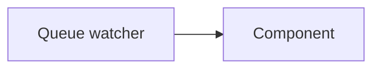

# eight

Experiment [six](https://github.com/jadudm/six) explored the creation of an end-to-end web crawler/indexer/search server in 2000 lines of Go.

Experiment eight is about getting some details closer to "right."

## goals

There are a bunch of possible goals. Some might be incompatible.

* It should be possible to deploy the end-to-end engine as a single binary on a single server, or a constellation of binaries on multiple servers.
  * Why? Perhaps we want to deploy "micro-search engines" that serve a single site in a specific data/operating, or perhaps we want to provide a common foundation layer.
* One core theme is "search as data pipeline." This means that the goal is to approach search as a series of successive additions/removals/transformations on data as independent, interacting components/services.
  * Why? Because there is more to the world of search than text. (And, even then, text can be handled many ways.) 
* For all their dangers (priority inversion, races, etc.), as much as possible is managed through queues.

## common component architecture

Each service should have a common architecture. This way, it is easy to either:

1. Wrap the service as a standalone application, fed by a queue, or 
2. Bundle multiple services in a single application, perhaps with a self-contained queue feeding the components.

In Go, the natural choice is a channel interface.

The queue watcher is a common component that pulls jobs from a queue, and messages them to the component. The channel interface allows for any number of patterns; the component can have a single processing loop that blocks on each job, or it can have a pool of workers processing the jobs that come in. What the component does is hidden from view, and allows for appropriate levels of complexity as needed.

In other contexts, this would be called an "API."

# services and components

There are a clear, core set of services and components required.

## queue server

The queue server can be abstracted over any number of implementations. That is, the substrate can be in-memory, SQLite files, Postgres, or Redis. The interface---the kinds of operations that are supported---is what matters.

_List of desirable properties..._

## crawler

The crawler needs to:

1. Dequeue pages from a frontier queue
2. Store pages in S3
3. Enqueue work for an indexer or other services

The storage medium could be abstracted away. That is, we might want to store to Postgres _or_ S3. But, there comes a point where you run out of turtles. So, in the spirit of building a notional data pipeline of services that want to do things to content, S3 fees _just fine_.

