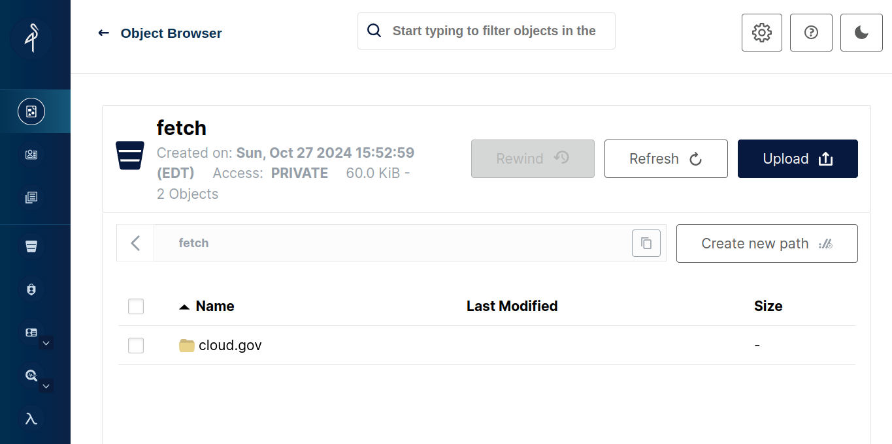
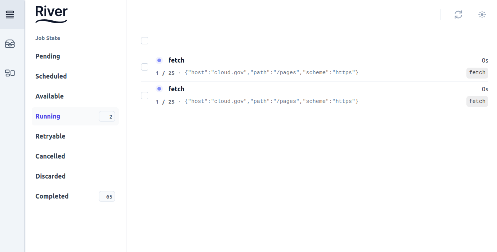

# eight

Experiment [six](https://github.com/jadudm/six) explored the creation of an end-to-end web crawler/indexer/search server in 2000 lines of Go.

Experiment eight is about getting some details closer to "right."

## running the experiment

In the top directory, first build the base/build container:

```
make build
```

Then, run the stack.

```
make run
```

The run generates the database API, and unpacks the USWDS assets into place.

## interacting with components

To begin a crawl:

```
http PUT localhost:10000/fetch host=fac.gov path=/
```

The file `container.yaml` is a configuration file with a *few* end-user tunables. The FAC website is small in HTML, but is *large* because it contains 4 PDFs at ~2000 pages each. If you only want to index the HTML, set `extract_pdf` to `false`. (This is good for demonstration purposes.)

To fetch a PDF, and see it extracted:

```
http PUT localhost:10000/fetch host=app.fac.gov path=/dissemination/report/pdf/2023-09-GSAFAC-0000063050
```

(approximately 100 pages)

## searching 

After a site is walked and packed, an SQLite file with full-text capabilities is generated. The `serve` component watches for completed files, grabs them from S3, and serves queries from the resulting SQLite database.

```
http POST localhost:10004/serve  host=fac.gov terms="community grant"
```

is how to search using the API; search terms are a single list, and SQLite pulls them apart.

A [WWW-based search interface](http://localhost:10004/search/fac.gov) can be found at [http://localhost:10004/search/fac.gov](http://localhost:10004/search/fac.gov). Note that the final part of the URL

```
http://localhost:10004/search/{HOST}
```

determines what indexed database will be searched. (E.g. if you have indexed `alice.gov` and `bob.gov`, you choose the database with the last part of the URL path.)

## browsing the backend

The goal is to minimize required services. This stack *only* uses Postgres and S3. 

## browsing S3

The S3 filestore is simulated using a containerized version of [Minio](https://min.io).



Point a browser at [localhost:9001](http://localhost:9001) with the credentials `nutnutnut/nutnutnut` to browse.

### watching the queue

There is a UI for monitoring the queues.



This lets you watch the queues at [localhost:11111](http://localhost:11111) provided by [River](https://riverqueue.com/), a queueing library/system built on Postgres. 


## by the numbers

```
-------------------------------------------------------------------------------
Language                     files          blank        comment           code
-------------------------------------------------------------------------------
Go                              51            559            258           2520
YAML                             4             15             53            404
Markdown                        12            199              0            326
JSON                             1              0              0            199
HTML                             1             21              5            171
Text                             1              0              0            127
Dockerfile                       6             26             15             61
make                             8             20              0             61
Python                           2              8              0             44
Bourne Shell                     5             10              0             30
SQL                              2              8             10             25
-------------------------------------------------------------------------------
SUM:                            93            866            341           3968
-------------------------------------------------------------------------------
```