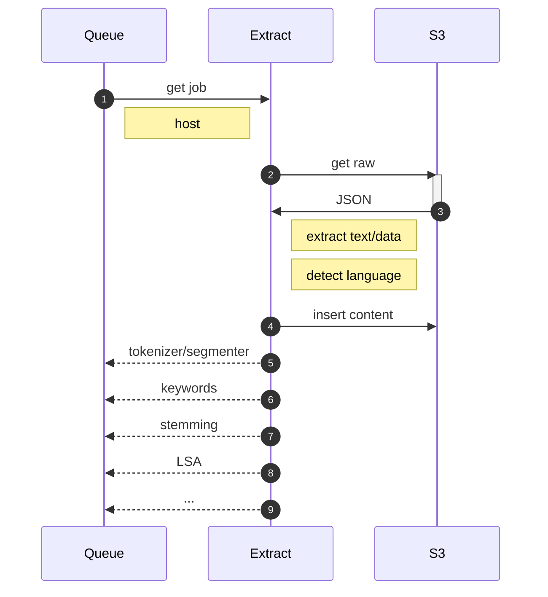

# extract

Extract converts raw content into something that can be indexed or otherwise further processed for search.

The extractor generally converts HTML to a single JSON document, and PDFs into one JSON document per page.

As we extract the text, we apply an NLP language detection algorithm in an attempt to tag the content as `en`, `es`, `de`, etc.

Content is inserted back into `s3` as a new set of JSON documents, keyed to the `host`. Keys from previous steps are retained, but the `raw` content is stripped at this point.

## next steps

Once the content is cleaned, multiple steps are possible.

* **tokenizer/segmenter**: We build up a sentence-level segmented version of the text, as well as parts-of-speech tagging
* **keywords**: Extract keywords for each document
* **stemming**: build a stemmed dictionary for each document
* **lsa**: latent semantic analysis and related techniques for conceptual search augmentation

... and possibly more.

These processes can all run in parallel; they will operate off the cleaned content, and produce outputs in separate buckets/paths in S3. This is a "fan out" pattern; we will then "fan in" when it comes time to build the DB that supports the search.

## resources

* https://awesome-go.com/natural-language-processing/
* https://github.com/pemistahl/lingua-go
* https://github.com/james-bowman/nlp
* https://github.com/afjoseph/RAKE.Go
* https://github.com/jdkato/prose/
* https://github.com/gorse-io/gorse
* https://awesomerank.github.io/lists/avelino/awesome-go.html#text-processing
