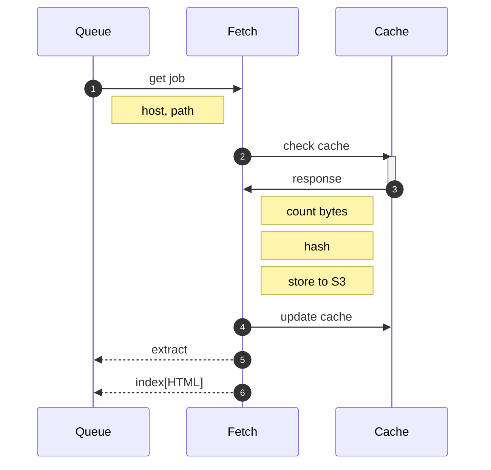

# fetch

Fetch follows a simple sequence:

1. Pull a job from the queue
2. Check the recent cache 
3. Fetch the content
4. Store the content
5. Update the recent cache

The cache helps us make sure we're not thrashing a page. 

Content is stored into the S3 bucket as JSON documents with a `raw` parameter. The `raw` parameter holds a Base64-encoded version of the raw bytestream of the content. This works for all content types: HTML, PDF, XLSX, etc.

## next steps

Depending on the content type, we might queue one or more jobs.

For all content, we want to perform a raw extraction. This is language-agnostic; we need to walk the structure of the document and pull out the content portions for further processing.

For HTML, we want to do further indexing. The indexer will walk the content for links, and queue more content to be fetched.

## references / libraries

* https://riverqueue.com/
* https://huma.rocks/
* https://github.com/go-chi/chi
