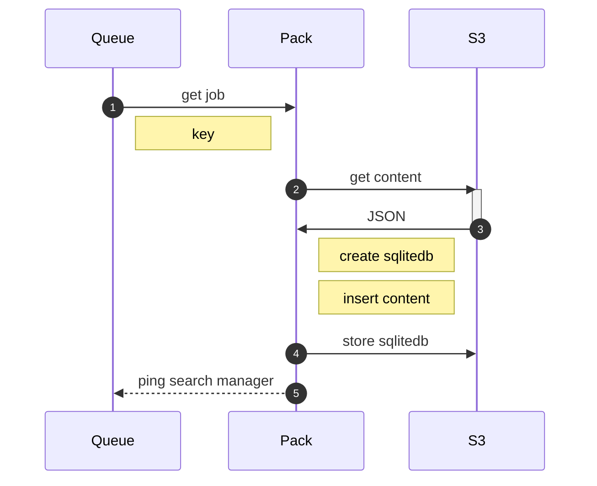

# pack

Pack takes content and turns it into databases.

When we `crawl` a site, we will push a message to the `pack` queue that lets the packer(s) know that a full rebuild is coming. Otherwise, we assume all `fetch` page requests result in *incremental* updates to a site's index.

A pack service runs the following algorithm:

1. Fetch the content
2. Create a DB
3. Insert the content, and start a timer on the domain:
   1. Start a timer on the domain:
      1. If the timer expires
         1. If we are doing an *incremental* update, fetch the existing DB and merge the local content over top
         2. If we are doing a full update, do nothing.
      2. If the timer has not expired
         1. Reset the timer
4. Push the resulting DB to S3
5. Delete the local DB
6. Enqueue distribution of the DB to a search server

The net result is a packer that can be largely ignorant of the rest of the universe, and correctly update databases with fresh content, or create entirely new databases of the content fetched within some time period. Because we reset the timer every time we see new content, we don't have to worry about how long a full crawl takes... we only have to wonder how long it has been since the last piece of content was processed.

## next steps

Once the content is packed, the search manager needs to be alerted that a given domain is ready for update. The search manager will then alert the search server responsible for that content, which will handle swapping the content in and out.

## improvements

The packer works off of one queue. This means we can end up with thousands of pages on the queue, and we will proceed through it linearly. 

If we have 1000 pages from alice.gov, 10 from bob.gov, and 100 from clarice.gov, we end up taking a long time to get to clarice.

A way to rework this would be to have per-host queues. This may be trickier than it sounds. It will require dynamically creating workers, and it may be that the structure of the queueing library makes that difficult.

Essentially: SQLite *can* do better concurrency than I'm experiencing. It can be fixed in a way that is more performant.

### extract only queues new domains to pack

`extract` keeps track what it has seen. If it is new, it posts to `pack` with the host. Otherwise, it assumes the host has been seen before. (This works for horizontal scaling of `extract`. It is OK to post the same host multiple times.)

## pack creates a new worker client for every new domain

`pack` watches for domains to come through. When it does, it creates 

1. A new set of processes for packing/processing content, and
2. A new set of workers for the queue `pack_<queue>`

This way, every host gets (e.g.) 10 workers *just for that host*. The traffic on the `pack` queue is low (because `extract` only posts novel hosts), and there is a startup cost the first time a new host is seen, but from then on, we are watching the `pack_<host>` queue.

Now, linearity is *per host*, but we process hosts in parallel.

## resources

Experiments four and six piloted this. Around the same time, Cloudflare published a blog post announcing their new "durable objects" feature.

In short, the approach to packing content for distribution as SQLite databases close to the edge of where they are needed is not a new idea (certainly), and has recently been deployed by Cloudflare as a product.

* https://www.cloudflare.com/developer-platform/durable-objects/
* https://blog.cloudflare.com/introducing-workers-durable-objects/