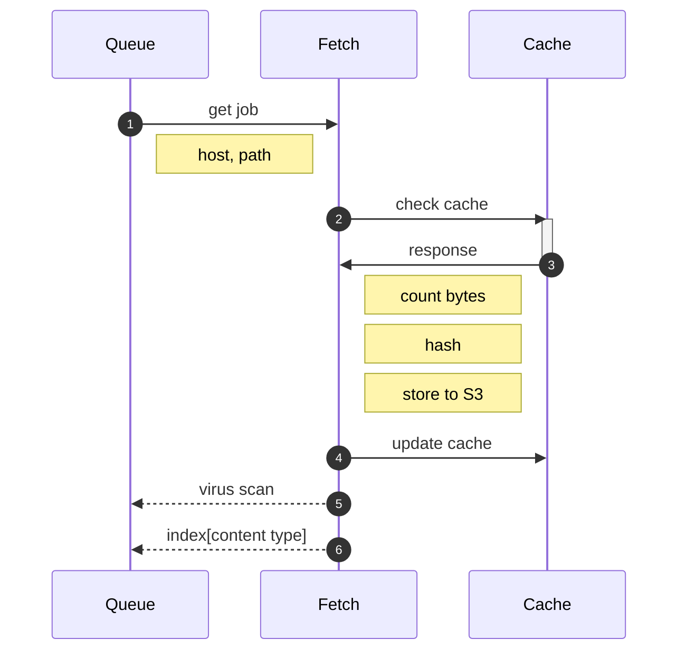

# crawler



## checking the cache

The cache holds pairs of

```
[host/path] <-> [S3 path]
```

If we check, and `""` comes back, it isn't in the cache.


## libraries

* https://github.com/tidwall/sjson
* https://github.com/tidwall/gjson